# Neighborhood Safety and High School Performances
Final Project for Introduction to Programming 

Xiaofan Liu
12/1/2017

### PART I. The Question
Students’ decisions making process on future education is influenced by a combination of factors, including but not limited to their past academic achievements, quality of schools, interests and external environment. There are numerous studies on school choices. The 5Essentials Reports for CPS draw from the 2016 My Voice, My School Student and Teacher Surveys, which are administered in collaboration with The University of Chicago Consortium on Chicago School Research (CCSR), clearly stated that schools that score strongly on such measures as supportive environment (including safety) are much more likely to improve academic achievement for their students. 

The target of this project is to explore the correlations between academic performances and the safety of schools’ locations for Chicago public high schools. In this project, we map crime records to high schools based on the distances between the two locations. By this method we can assess the regional safety for the neighborhoods that the schools are located. We plotted different academic factors and safety levels on maps to investigate clustering patterns, tested the correlations between total number of crimes near the school and different academic factors, and further broke data down by types of crimes to test relationships with different academic factors.  

#### Past Work
In terms of school choice, based on a survey conducted in Ohio region, safety is the top one concern when choosing schools for their children. Another survey of survey the D.C. Opportunity Scholarship Program showed the similar results: parents and children names safety top consideration, regardless of their ethnicities or ages ( **[`Stewart and Wolf, 2016`](http://educationnext.org/power-to-the-people-the-school-choice-journey-review-stewart-wolf/)** ). In terms of school performance, a study conduct in Florida showed that  a 1 percentage point increase in a school’s mean school safety score increases a school’s FCAT score by 18 points, on average ( **[`Christopher Duszka, 2015`](http://www.ijessnet.com/wp-content/uploads/2015/09/4.pdf)**). Not to mention the research on 5Essentials reports  is a clear statement on importance of safety. 

### PART II. Data sources
Check-out scripts for the data in this analysis can be found in my **The folder [`DATA`](https://github.com/cicilau/Final-project-safety-and-school-choices/tree/master/DATA)**  repository.
Check-out list of contents in  **file [`Contents List.md`](https://github.com/cicilau/Final-project-safety-and-school-choices/tree/master/Contents_List.md)** 
The performance data are from several different portals but they are all from Chicago Public Schools (CPS) originally. CPS assign each school a unique School ID in all different data sets and studies, so it helps us combine variables from multiple files by matching the School ID.

#### 1.High Schools locations and their safety level
We are using data of performance of public schools in chicago from file Chicago Public Schools-School Progress Reports SY1617, downloaded from city of Chicago data portal(https://data.cityofchicago.org/Education/Chicago-Public-Schools-School-Progress-Reports-SY1/cp7s-7gxg). 

We selected 5 variables: "School_ID','Short_Name', 'Safety_Level', 'School_Latitude', and'School_Longitude', gave values of 1 to 5 to safety levels of 'very weak', 'weak', 'neutral', 'strong' and 'very strong', dropped schools with 'not enough data', and saved these as refined_progress.csv. 

Check-out codes in  **file [`progress_report.py`](https://github.com/cicilau/Final-project-safety-and-school-choices/tree/master/progress_report.py)** 

#### 2.High Schools Performance
We downloaded average ACT scores on school level from year 2001 to year 2016 and selected only 'school ID', 'Year' and 'Composite'(ACT scores). Similarly from cps.edu, we downloaded 'CPS Graduates College Enrollment/Persistence by School for 2010-2015' for college enrollment rate, 'School 5 Year Cohort Rates' for cohort dropout rates and graduation rates, and converted SQRP(School Overall Rating Policy) levels from 'level 3', 'level 2', 'level 2+', 'level 2', 'level 1' and 'level 1+' to 1 to 5. 

Check-out codes in  **file [`act.py`](https://github.com/cicilau/Final-project-safety-and-school-choices/tree/master/act.py)** , **file [`graduation.py`](https://github.com/cicilau/Final-project-safety-and-school-choices/tree/master/graduation.py)**, **file [`college.py`](https://github.com/cicilau/Final-project-safety-and-school-choices/tree/master/college.py)**, and  **file [`rating.py`](https://github.com/cicilau/Final-project-safety-and-school-choices/tree/master/rating.py)**

#### 3. Crime records
Crime data are from City of Chicago Data Portal. We downloaded the data sets for 2016 and 2017 to cover the 2016 school year and selected “Case ID”, “Crime Type”, “Latitude” and “Longitude”. The key to this project is matching the crime data to schools to reflect the safety conditions of the neighborhood around. Here we used the number of crime cases within 0.5km distance to the school as the variable. Therefore, We mapped the criminal cases to schools with their latitudes and longitude. 

Check-out codes in  **file [`map_crime.py`](https://github.com/cicilau/Final-project-safety-and-school-choices/tree/master/map_crime.py)** 

#### 4.Merging data
The numbers of criminal cases happend in each school's neighborhood were counted based on distance to school's location( “Latitude” and “Longitude” ) and added as a new column to the final data table. We paired up datasets above on 'School ID' to put all data needed in to a final data table called data_table.csv.

Check-out codes in  **file [`finalize_data.py`](https://github.com/cicilau/Final-project-safety-and-school-choices/tree/master/finalize_data.py)** 

### PART III. Investigation

Simple description analysis has been added by section in **file [`data_analyze.ipynb`](https://github.com/cicilau/Final-project-safety-and-school-choices/tree/master/data_analyze.ipynb)**.

#### 1. Summary of data
We analyzed 181 high schools from CPS in total. The following graphs show the distributions of SQRP level, safety level, average ACT scores, graduation rate, and college enrollment rate. First, the counts of schools on different SQRP ratings and safety levels are plotted below. For the SQRP ratings, schools with higher numbers have better qualities. For the safety levels, schools with higher numbers have more responses with safer neighborhoods. The number of schools rating at Level 3 is 2. The differences between school counts on other levels are not very large. There are two peaks at Level 2 and Level 1+. The median score is 3, which is Level 2+.

The school counts on different safety levels has a very high peak at the level of 2 (weak) with strong left skewness, and a small tail with levels of 4 and 5 (strong and very strong). The median safety value is 2 (weak). The distribution of Total Crimes is similar as the graph of Safety Level. The average ACT scores of schools display a broad distribution between 12 and 20, and with a high peak at 15 with left skewness. There is a tail at the right for scores higher than 20 consist of about 15 schools. The mean score is 16.68 and the median is 15.95. The graduation rates are in a right skewed distribution with a peak near 85% and big tail at the left. The mean value is 75.83 and the median is 78.6. Another small peak can be found near 65%. The college enrollment percentages are in a broad distribution with a small right skewness. The differences between school counts of different percentages are small (with values of 8~20). The highest peak is at near 65%, while two other peaks can be found near 0% and 85%. The mean value is 47%.

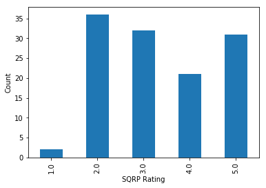 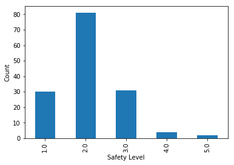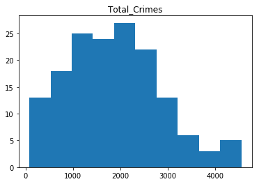
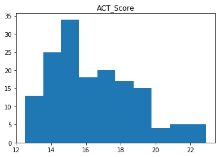 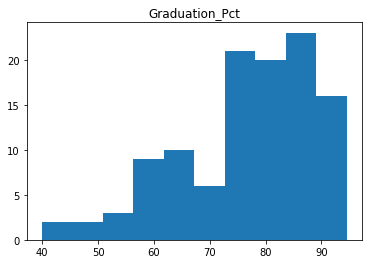 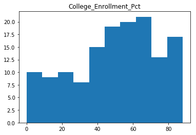

The schools in the safest neighborhoods are:

Short_Name | Level | Safety_Level | Total_Crimes
-----------| ----- | ------------ | ------------
OMBUDSMAN - NORTHWEST HS | NaN | 3.0 | 81.0
CHICAGO AGRICULTURE HS | 5.0 | 3.0 | 154.0
CICS - NORTHTOWN HS | 5.0 | 3.0 | 234.0
WASHINGTON HS | 4.0 | 2.0 | 279.0
SOCIAL JUSTICE HS | 3.0 | 2.0 | 285.0
PATHWAYS - ASHBURN HS | NaN | 4.0 | 332.0
TAFT HS | 4.0 | 2.0 | 345.0
WORLD LANGUAGE HS | 5.0 | 2.0 | 345.0
YCCS - OLIVE HARVEY | NaN | 2.0 | 350.0
MULTICULTURAL HS | 3.0 | 2.0 | 397.0

The schools in the most dangerous neighborhoods are:

Short_Name | Level | Safety_Level | Total_Crimes
-----------| ----- | ------------ | ------------
NOBLE - DRW HS | 3.0 | 2.0 | 4549.0
YCCS - CCA ACADEMY | NaN | 2.0 | 4536.0
YCCS - SCHOLASTIC ACHIEVEMENT | NaN | 2.0 | 4444.0
MAGIC JOHNSON - N LAWNDALE HS | NaN | 3.0 | 4177.0
AUSTIN CCA HS | 2.0 | 1.0 | 4173.0
NOBLE - ROWE CLARK HS | 3.0 | 1.0 | 4045.0
NORTH LAWNDALE - CHRISTIANA HS | 2.0 | 1.0 | 4009.0
LEGAL PREP HS | 3.0 | 2.0 | 3978.0
YCCS - AUSTIN CAREER | NaN | 2.0 | 3630.0
HIRSCH HS | 2.0 | 3.0 | 3362.0

#### 2. Different factors on map
Following scatter plots are differents factors on Chicago map(point your mouse on the graph, the name of that graph will show up). The spatial scatter plots of school locations are shown below each bar plot with colors representing the safety levels or performance scores. A school with higher score (warmer color) is safer or performs better.  The spatial distributions of schools display weak clustering, but a clear pattern can be observed that most of good schools (in safer locations or better performances) are in the north region of Chicago

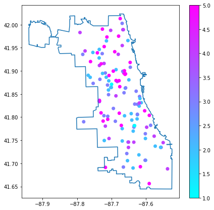 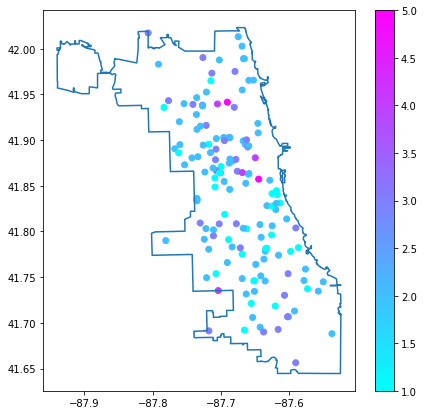 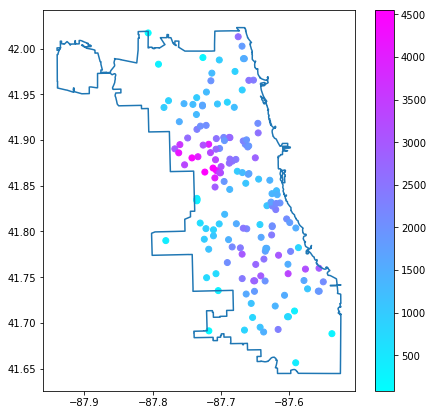
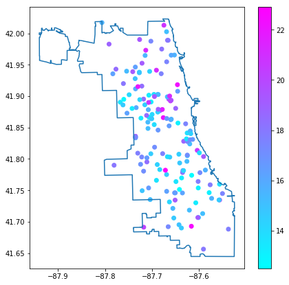 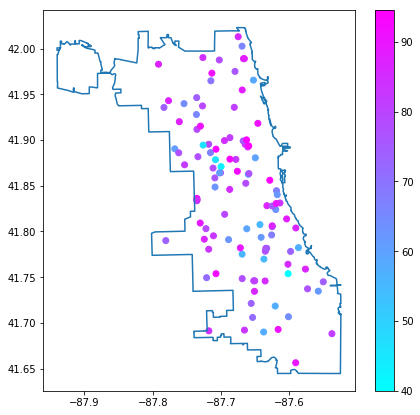 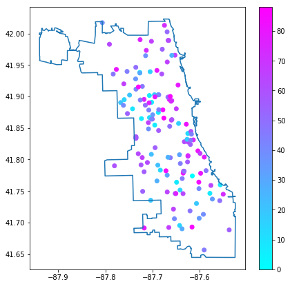

Adding the school attendance boundaries, the pattern is much easier to identify. There are three dark green areas on the left map, indicating the three neighborhoods with the best overall performance. In the middle area of the left map, the color is light green to white, indicating that schools there have very low levels of overall performance. For the right map, it's clear that the darkest red area, the area with highest number of crime per school, overlaps with the area of schools with lowest levels of overall performance. It's reasonale for us to infer that the number of crimes is highly associated with school performance. 

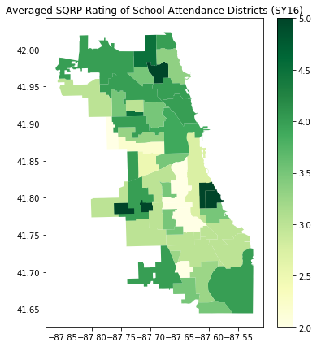 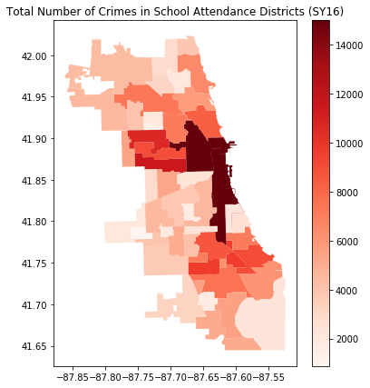

#### 3: Scatter Matrix Analysis of Selected Variables
The pair-wise scatter plots are shown below for academic factors and the total crime predictor. Strong correlations can be observed from the performance variables (ACT, Graudation and College enrollment). It implies that the three variables we selected are consistent to assess the qualities of high schools, and their trends are in good agreement. However there is nothing obvious between these three factors and total number of crimes.

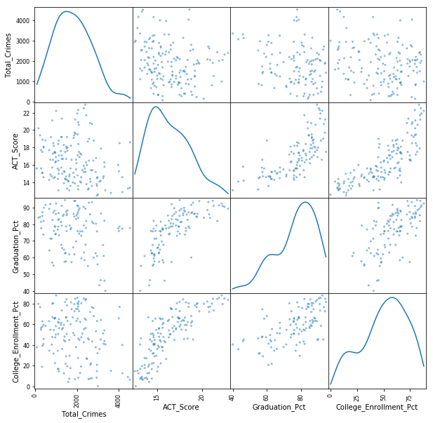

#### Step 4: Correlations with number of total crimes (marked as 'total crimes'below)
Regression analysis with OLS method was used on the varible of total crimes. The plots and trend lines for the four performance variables are shown below. All of them display clear trends that higher crime rates will lower the performance.

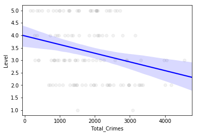 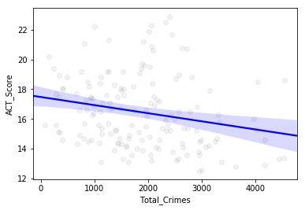

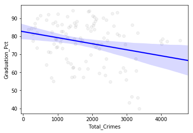 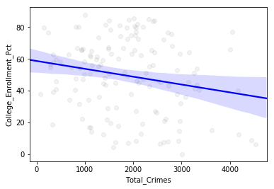

The statistics parameters are summarized in the table below. All the slope coeffients are negative and statistically significant (>95% probabilities that the true values are not zero).

Dependent | Slope | T-value | Pr | R-square
--------- | ----- | ------- | -- | --------
SQRP rating | -0.0003 | -3.130 | 0.002 | 0.075
ACT Score | -0.0005 | -2.832 | 0.005 | 0.050
Graduation rate | -0.0034 | -2.858 | 0.005 | 0.069
College rate | -0.0049 | -2.493 | 0.014 | 0.043

#### Correlations breakdown by types of crimes
The results of multivariable regressions on different types of crimes are listed below. Nothing significant here can be observed for the graduation rate. Statistically significant dependences can be only found with the type of battery crimes to the performances of average ACT score and College enrollment rate. One interesting finding is that Total_Thefts and Total_Assaults are both positive associated with college enrollment rate. Does this have conflicts with our previous finding? Not really. Correlation does not indicate causality. Also there is possiblity that a few schools with high college enrollment rates located in the neighborhood with high number of assaults but not with high number of total crimes. That's definitely something to dig deeper in the future.

**SQRP** | coef | std err | t | Pr | \[0.025 | 0.975\]
-------- | ---- | ------- | - | -- | ------ | ------
Intercept | 3.7039 | 0.335 | 11.043 | 0.000 | 3.038 | 4.370
Total_Thefts | 5.327e-05 | 0.001 | 0.084 | 0.934 | -0.001 | 0.001
Total_Batteries | -0.0040 | 0.003 | -1.567 | 0.120 | -0.009 | 0.001
Total_Assaults | 0.0044 | 0.006 | 0.685 | 0.495 | -0.008 | 0.017
Total_Robberies | 0.0057 | 0.005 | 1.228 | 0.222 | -0.003 | 0.015
Total_Weapon_Violations | 0.0005 | 0.008 | 0.062 | 0.951 | -0.016 | 0.017
Total_Homicides | -0.0165 | 0.038 | -0.432 | 0.666 | -0.092 | 0.059

**ACT Score** | coef | std err | t | Pr | \[0.025 | 0.975\]
------------- | ---- | ------- | - | -- | ------ | ------
Intercept | 16.3955 | 0.578 | 28.347 | 0.000 | 15.251 | 17.540
Total_Thefts | 0.0021 | 0.001 | 1.862 | 0.065 | -0.000 | 0.004
Total_Batteries | -0.0098 | 0.004 | -2.216 | 0.029 | -0.019 | -0.001
Total_Assaults | 0.0178 | 0.011 | 1.603 | 0.112 | -0.004 | 0.040
Total_Robberies | 0.0012 | 0.008 | 0.160 | 0.873 | -0.014 | 0.017
Total_Weapon_Violations | 0.0024 | 0.013 | 0.175 | 0.861 | -0.024 | 0.029
Total_Homicides | 0.0036 | 0.065 | 0.056 | 0.956 | -0.125 | 0.132

**Grad. Rate** | coef | std err | t | Pr | \[0.025 | 0.975\]
-------------- | ---- | ------- | - | -- | ------ | ------
Intercept | 82.9635 | 3.652 | 22.714 | 0.000 | 75.701 | 90.226
Total_Thefts | 0.0019 | 0.008 | 0.245 | 0.807 | -0.013 | 0.017
Total_Batteries | -0.0289 | 0.028 | -1.041 | 0.301 | -0.084 | 0.026
Total_Assaults | -0.0025 | 0.068 | -0.036 | 0.971 | -0.139 | 0.134
Total_Robberies | 0.0484 | 0.053 | 0.913 | 0.364 | -0.057 | 0.154
Total_Weapon_Violations | 0.1191 | 0.090 | 1.321 | 0.190 | -0.060 | 0.298
Total_Homicides | -0.7393 | 0.424 | -1.746 | 0.085 | -1.581 | 0.103

**Col. Pct.** | coef | std err | t | Pr | \[0.025 | 0.975\]
------------- | ---- | ------- | - | -- | ------ | ------
Intercept | 49.7486 | 6.235 | 7.978 | 0.000 | 37.393 | 62.104
Total_Thefts | 0.0277 | 0.013 | 2.093 | 0.039 | 0.001 | 0.054
Total_Batteries | -0.1129 | 0.046 | -2.478 | 0.015 | -0.203 | -0.023
Total_Assaults | 0.2278 | 0.115 | 1.987 | 0.049 | 0.001 | 0.455
Total_Robberies | -0.0710 | 0.088 | -0.809 | 0.420 | -0.245 | 0.103
Total_Weapon_Violations | 0.1251 | 0.140 | 0.894 | 0.373 | -0.152 | 0.402
Total_Homicides | 0.0288 | 0.695 | 0.041 | 0.967 | -1.348 | 1.406

## Conclusions and limitations

Overall, local regional safety has a statistically significant impact to the performances of high schools. The safer the neighborhood is, the better the school will perform. One the one hand, a safe neighborhood can provide children a comfortable environment for study. On the other hand, good neighborhoods usually have more rich or well educated families, whose children usually perform better. Among all types of crime, we found that battery crimes is the most significant impact to the school performance, probably because there is some correlations between battery crimes and insecurity of young people.

However, the correlations could only tell us 'what', not 'why'. It's possible that there is a three factor: hours in learning after school, which might be negatively associated with safety but positively associated with school performance. Without ruling out this and other possibilities, we could not have any certain conclusions.

Another limitation here is other factors missing from the analysis. For example, we only take the number of crimes into consideration but not the number of crimes solved within neighborhoods. Other non-academic factors such as disciplines in schools or number of security in schools might play a more important role here. Also the sample size is not large enough. It will be interesting to do the same analysis on other cities and compare among their patterns.

